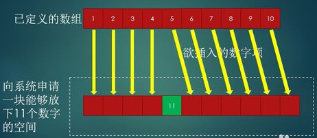

# 常见的数据结构

- [数组](#Array)
- [数组链表](#Chain)
- [哈希表](#Hash Map)

## Array

计算机中的数组与数学中的数组概念类似，只是计算机中的数组的值可以是多种类型。
一般语言中的数组，指的都是连续线性表，也就是所有元素依次存储在一片连续的存储空间内，但js比较特殊，js中的数据结构就只有一种：哈希表。
哈希表用来描述Object，其他所有的数据结构，都是建立在哈希表上的伪结构。比如数组，其实就是key为index的对象，其底层，也就是哈希表。

> ES6中的typed Array和ArrayBuffer是存储连续内存的数组，与传统意义上的数组一样。

对于传统的数组来说，由于数据保存在连续的内存块中、数组头保存了数组的地址，所以数据的定位是非常方便的。
根据数组地址+元素的偏移量算出指定元素的内存地址，直接移动指针到该处即可进行数据的读写。

但是由于数据存储的空间连续，所以对元素的增删就变得非常麻烦，比如要在第五位插入一个元素，那么第五位后面的所有元素都要向后挪一个数组空间的位置。
实际操作中我们还需要额外的临时空间来保存要移动的元素，然后依次移动各个元素，相当繁琐。

PS：js中常规的数组操作这里不做介绍，仅介绍数据结构原理。

## Chain

因为数组增删非常麻烦，所以链表这种数据结构就被设计出来了。
链表元素的存储空间都是分散的，每个元素除了保存本身的值之外，还保存着其他元素的内存地址，根据地址就可以将整个链表串起来了。

