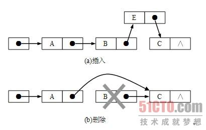

## 基本数据结构之数组与链表，队列与栈

- [数组](#array)
- [链表](#chain)
- [栈](#stack)
- [队列](##queue)

以上4种数据结构都是线性表结构。线性表是最基本、最简单、也是最常用的一种数据结构。
线性表中数据元素之间的关系是一对一的关系，即除了第一个和最后一个数据元素之外，其它数据元素都是首尾相接的。
线性表有两种存储方式，一种是顺序存储结构，另一种是链式存储结构。
顺序存储结构的线性表也称为连续线性表，也就是所有元素依次存储在一片连续的存储空间内。
链式存储结构的线性表里面，元素与元素通过地址指针来将各个元素链接在一起。

### Array

计算机中的数组与数学中的数组概念类似，只是计算机中的数组的值可以是多种类型。
一般语言中的数组，指的都是连续线性表，但js比较特殊，js中的数据结构就只有一种：哈希表。
哈希表用来描述Object，其他所有的数据结构，都是建立在哈希表上的伪结构。
比如数组，其实就是key为index的对象，其底层也就是哈希表。所以js中的数组并不储存在一片连续的存储空间里。

> ES6中的typed Array和ArrayBuffer是存储连续内存的数组，与传统意义上的数组一样。

对于传统的数组来说，由于数据保存在连续的内存块中、数组头保存了数组的地址，所以数据的定位是非常方便的。
根据数组地址+元素的偏移量算出指定元素的内存地址，直接移动指针到该处即可进行数据的读写。

但是由于数据存储的空间连续，所以对元素的增删就变得非常麻烦，比如要在第五位插入一个元素，那么第五位后面的所有元素都要向后挪一个数组空间的位置。
如果是删除元素，那么就需要将后面的元素依次向前挪一个位置。实际操作中我们还需要额外的临时空间来保存要移动的元素，然后依次移动各个元素，相当繁琐。


js中封装好的操作数组元素的方法有：
- push：向数组末尾添加**任意**个元素，@return 修改后的新数组长度
- pop：从数组末尾移除最后**一个**元素，@return 被移除的元素
- shift：从数组头部移除最前**一个**元素，@return 被移除的元素
- unshift：向数组头部添加**任意**个元素，@return 修改后的新数组长度
- splice：前2个参数为操作起始点和删除个数，第3个参数开始是插入的元素，@return 被删除项组成的数组
- sort和reverse：数组排序和反转，其中排序方法接受一个排序函数，可以自定义排序规则。例如：
```javascript
array.sort(function (pre, next) {
   return pre - next; // 返回负数则pre在前，返回正数则pre在后 
});
```

注: 以上这些操作都是对数组元素的操作，是直接改变原数组的方法；以下方法不改变原数组，只返回新数组：

- concat：连接两个或者多个数组。
- slice：从当前数组中截取得到一个新数组。

还有一些比较实用的方法：

- forEach：对数组的所有元素都执行传入函数，无返回值
- map: 对数组的所有元素都执行传入函数，@return 函数返回值组成的数组，也就是数组映射
- filter：对数组的所有元素都执行传入函数，@return 函数返回值为真的元素组成的数组，也就是数组过滤
- every：对数组的所有元素都执行传入函数，@return 当所有元素的返回值都为真时，返回真。数组全体的与操作
- some：对数组的所有元素都执行传入函数，@return 当任一元素的返回值为真是，返回真。数组全体的或操作。
以上传入函数的参数均为 item、index、array，后两项为可选参数。例如平方映射函数：
```javascript
array.map(function (item,index,array) {
  return item * item;
})
```

- reduce：从头到尾依次迭代，将每次迭代的结果作为输入与当前元素执行传入函数。
- reduceRight：从尾到头依次迭代，刚好与reduce相反。
例如一个数组求和：
```javascript
array.reduce(function (prev,next,index,array) {
    return prev + next;
})
```

### Chain

因为传统数组的存储空间都是连续的，元素的增删操作非常麻烦，所以链表这种数据结构就被设计出来了。
链表元素的存储空间都是分散的，每个元素除了保存本身的值之外，还保存着其他元素的内存地址，根据地址就可以将整个链表串起来了。
根据这个特点，只要我们改写一个元素指向的内存地址指向一个新的链表元素，然后设置新的链表元素指向原来元素指向的地址，就插入了一个链表元素。
由于链表的所有元素的实际内存地址并不连续，所以也就不必像定义数组一样声明其存储空间了，换言之链表占用的是动态空间。



js中数组本身就不是连续的，所以在js中直接使用数组即可，没必要使用链表结构。

为了加深理解，这里也给出一个在js中通过对象来模拟链表结构的写法，相关测试在[chain.js](./chain.js)文件中。

```javascript
function Chain(key, value) {
	this.next = null;
	this.key = key;
	this.value = value;
	this.length = 1;
}

// 插入元素
Chain.prototype.insertAfter = function (pos, key, value) {
	var currentObj = this;
	var addObj = {
		key  : key,
		value: value
	}
	while (currentObj.key !== pos) {
		currentObj = currentObj.next;
	}
	addObj.next = currentObj.next;
	currentObj.next = addObj;
	this.length++;
	return this;
}

// 删除元素
Chain.prototype.delele = function (key) {
	var last = null;
	var currentObj = this;
	while (currentObj.key !== key) {
		last = currentObj;
		currentObj = currentObj.next;
	}
	last.next = currentObj.next;
	this.length--;
	return this;
}

// 查找元素
Chain.prototype.find = function (key) {
	var currentObj = this;
	while (currentObj.key !== key) {
		currentObj = currentObj.next;
	}
	return currentObj.value;
}
```


